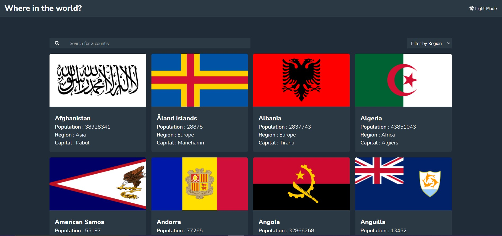

# Frontend Mentor - REST Countries API with color theme switcher solution

This is a solution to the [REST Countries API with color theme switcher challenge on Frontend Mentor](https://www.frontendmentor.io/challenges/rest-countries-api-with-color-theme-switcher-5cacc469fec04111f7b848ca). Frontend Mentor challenges help you improve your coding skills by building realistic projects.

## Table of contents

- [Overview](#overview)
  - [The challenge](#the-challenge)
  - [Screenshot](#screenshot)
  - [Links](#links)
- [My process](#my-process)
  - [Built with](#built-with)
  - [What I learned](#what-i-learned)
- [Author](#author)
- [Acknowledgments](#acknowledgments)

## Overview

### The challenge

Users should be able to:

- See all countries from the API on the homepage
- Search for a country using an `input` field
- Filter countries by region
- Click on a country to see more detailed information on a separate page
- Click through to the border countries on the detail page
- Toggle the color scheme between light and dark mode _(optional)_

### Screenshot

### Links

- Solution URL: [Add solution URL here](https://your-solution-url.com)
- Live Site URL: [Add live site URL here](https://your-live-site-url.com)

## My process

### Built with

- HTML
- SCSS
- Flexbox
- CSS Grid
- [React](https://reactjs.org/) - JS library
- [React Router Dom](https://reactrouter.com/web/guides/quick-start) - For routing

### What I learned

How to implement Dark Mode in React.

## Author

- Website - [Juan Manuel Sanchez Diaz](https://jmsanchezdiaz.github.io/portfolio)
- LinkedIn - [Juan Manuel Sanchez Diaz](https://www.linkedin.com/in/juan-manuel-sanchez-diaz-1bb0661bb/)
- Twitter - [@juanmasd2002](https://www.twitter.com/juanmasd2002)

## Acknowledgments

Hi, i hope you enjoyed my solution to rest countries app challenge. I had a fun time coding this, and learnt a few things.
